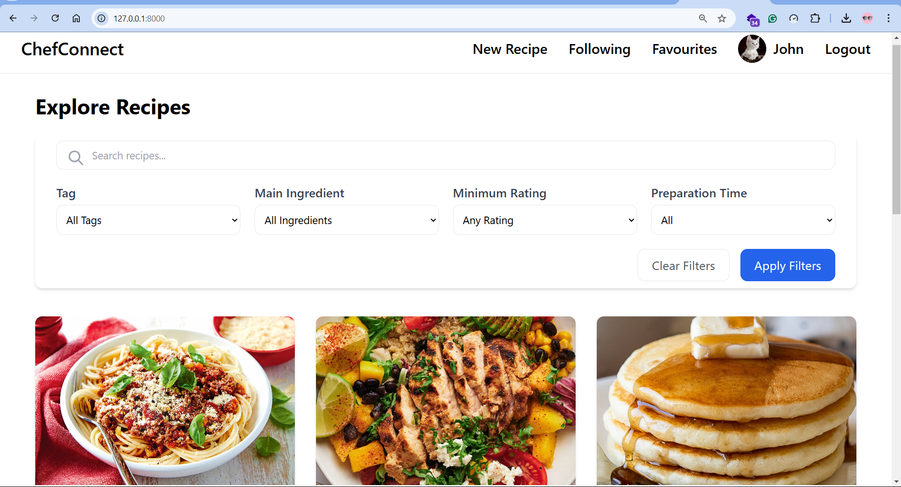
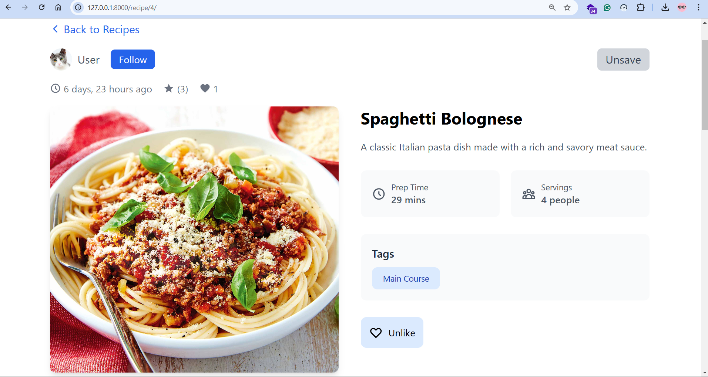
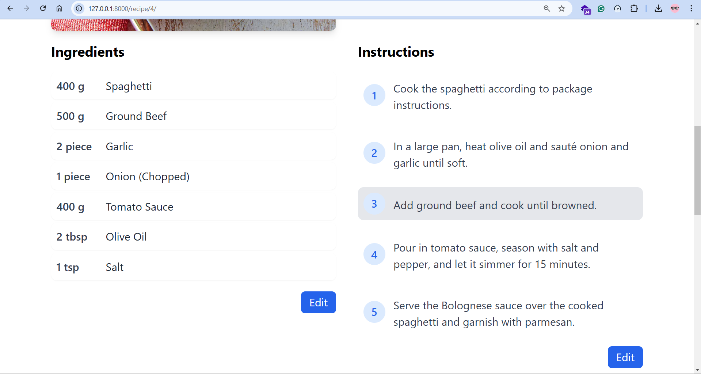
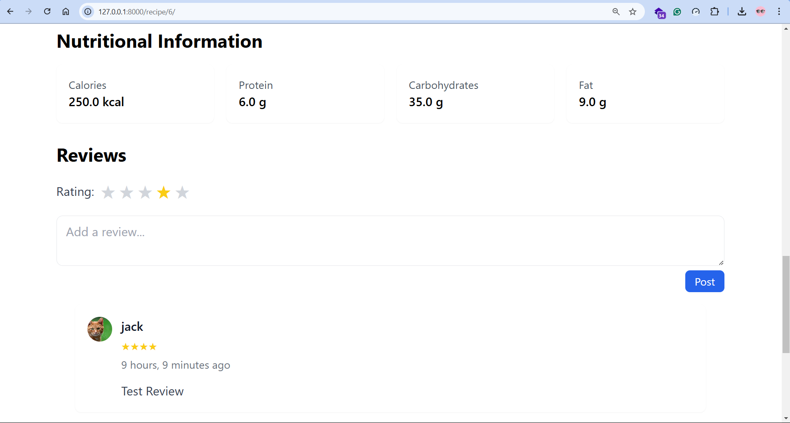
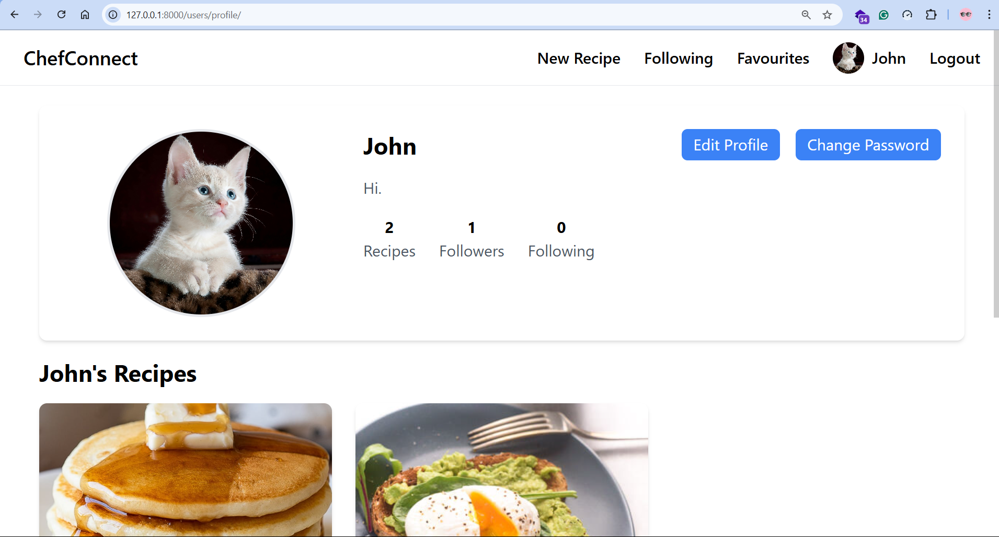
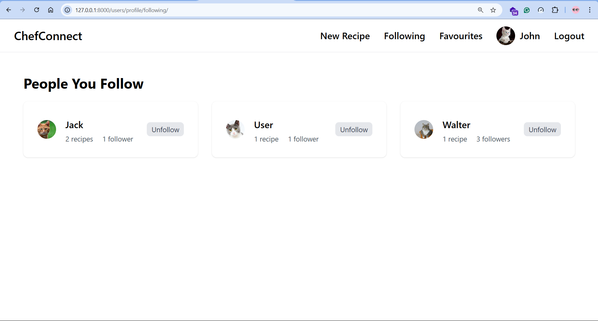
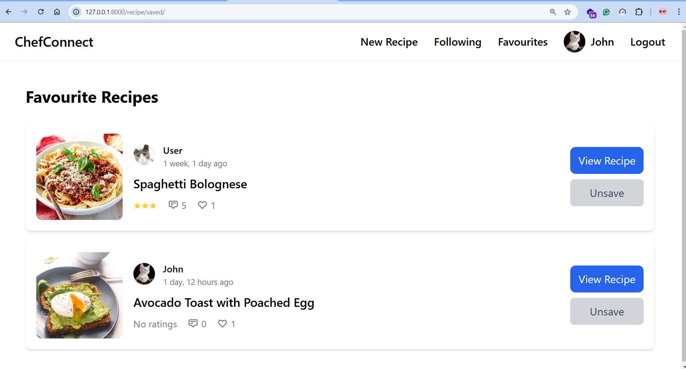

# ChefConnect

ChefConnect is a full-stack web application built as a final project for **Harvard CS50's Web Development with Python
and
Javascript** Course. It is build using Python's Django Web Framework for backend, Tailwind CSS and Javascript
for frontend, and SQLite3 for database.

### Video Demo:

### Screenshots:










## What is ChefConnect?

**ChefConnect** is a social media platform designed specifically for culinary enthusiasts and chefs to share recipes and
connect with each other. Users can discover new recipes through an intuitive interface with powerful filtering options
by tags and ingredients.
With ChefConnect, you can create an account to access a personalized home page displaying recipes from the community.
The platform enables users to interact by giving reactions to recipes, providing ratings and reviews, saving favorites,
and following other users to build their culinary network.

## How to Run

1. Clone the repository

```bash
  git clone https://github.com/SawZiDunn/ChefConnect.git
```

2. Navigate to the project directory

```bash
  cd chefconnect
```

3. Install dependencies

```bash
  pip install -r requirements.txt
```

4. Apply migrations

```bash
  python manage.py makemigrations
  python manage.py migrate
```

5. Run the development server

```bash
  python manage.py runserver

```

## Main Features

The application is mobile-responsive and includes the following features.

### Authentication and Authorization

- Secure user registration, login, and logout functionality
- Restricted access for unauthorized users, limiting them to viewing only existing recipes and details
- Automatic redirection to the login page when attempting to access protected routes

### Recipe Management

- Browse and view detailed recipe information
    - Advanced search and filtering system by name, tags, ingredients, rating, and preparation time
    - Comprehensive recipe creation with:
        - Tag selection from existing tags or creation of new ones
        - Ingredient assignment from existing ingredients or creation of new ones
        - Step-by-step instruction management
        - Detailed nutrition information input (carbohydrates, protein, etc.)

- Edit recipe information with:
-
    - Update general information and associated tags
    - Modify ingredient lists, measurements, and units
    - Revise cooking instructions and steps

### Social Interactions

- Reactions: Give reactions to recipes with total reactions displayed
- Rating and Reviews:

    - Give ratings along with reviews for each recipe
    - View average ratings and all reviews given by other users

- Follow System:

    - Build a network by following other culinary enthusiasts
    - View all followed users in a dedicated section

- Favorites:

    - Save recipes to personal favorites collection
    - Access all saved recipes easily

### User Profile

- Visit Other user's profile
- View all recipes shared by the user
- Edit your own user information like username, email and profile picture
- Change password

## Distinctiveness and Complexity

This project utilizes features that are outside the course criteria like Django Forms for data handling and Tailwind CSS
for the user interface instead of Vanilla CSS. It was a challenging experience as this was my first time working with
Tailwind and its complex classes.

### Server-Side Rendering

Utilize Django's powerful templating engine for server-side rendering:

- Faster initial page loads with pre-rendered HTML
- Improved SEO performance through complete page content
- Reduced client-side processing requirements

### JavaScript Integration

Utilize JavaScript for Frontend to enhance user experience without reducing performance:

- Asynchronous AJAX requests for dynamic content loading without page refreshes
    - Dynamic updates for reactions, saving recipes or following users

- Real-time form validation before submission
- Interactive UI elements including:
    - Tag selection with instant visual feedback for selected tags and removing them
    - Automatic display of selected tags, ingredients and instructions when edit page is loaded
    - Star rating system with hover effects

## File Structure and How it works

ChefConnect works with three Django apps, each responsible specific functionalities.

- **users**: Handles authentication, profiles, and user relationships
- **recipe**: Manages recipe creation, editing, and browsing functionality
- **interactions**: Controls social features like reactions, ratings, reviews, and favorites

Each app maintains its own:

- `urls.py`: Defines URL routing patterns
- `views.py`: Contains logic for processing requests and rendering templates
- `models.py`: Defines database schema and relationships
- `templates/`: Stores HTML templates specific to the app
- `static/`: Mostly contains JavaScript files for dynamic frontend interactions, each js file relates to one html
  template

JavaScript files work with Django views though AJAX requests.
Global templates are stored in the root `templates/` directory, and `base.html` serves as the main layout template
that all other pages extend.
User uploads are managed in the `media/` directory, with separate folders for profile and
recipe images.

### Technology Stack

- Backend: Python, Django
- Frontend: HTML, Tailwind CSS, JavaScript
- Database: SQLite3 (default)
- Authentication: Django Authentication System

